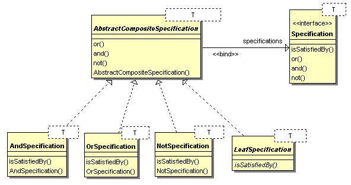

# Specification
### Behavioral Design Patterns

#### Обобщение
Specification (Rules) Pattern-ът комбинира различни правила (and/or/not). Използва се когато имаме сложна и растяща (бързо изменяща се) бизнес логика. Използва булева логика. Разделя индивидуалните правила от обработването на логиката - лесно се добавят нови правила (Open/closed principle).

Имплементират се предефинираните правила AND, OR, NOT, които имплементират ISpecification. Други конкретни спецификации също могат да бъдат създадени.

#### Имплементация - [Specification](Specification/)
