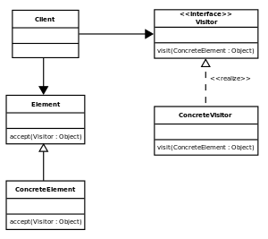

# Visitor
### Behavioral Design Patterns

#### Обобщение
Visitor представлява операция, която да бъде изпълнена върху обект. Позволява ни да дефинираме нова операция върху обект, без да променяме елементите/структурата на класа. Може да се използва за добавяне на функционалност върху библиотеки, чийто код не може да се променя.

Visitor-ът може и да е йерархичен - да посещава всеки елемент в йерархична структура от данни.

Visitor-ът декларира операция за всеки конкретен клас, а класа дефинира Accept метод, който приема Visitor като аргумент.

#### Имплементация - [Visitor](Visitor/)
