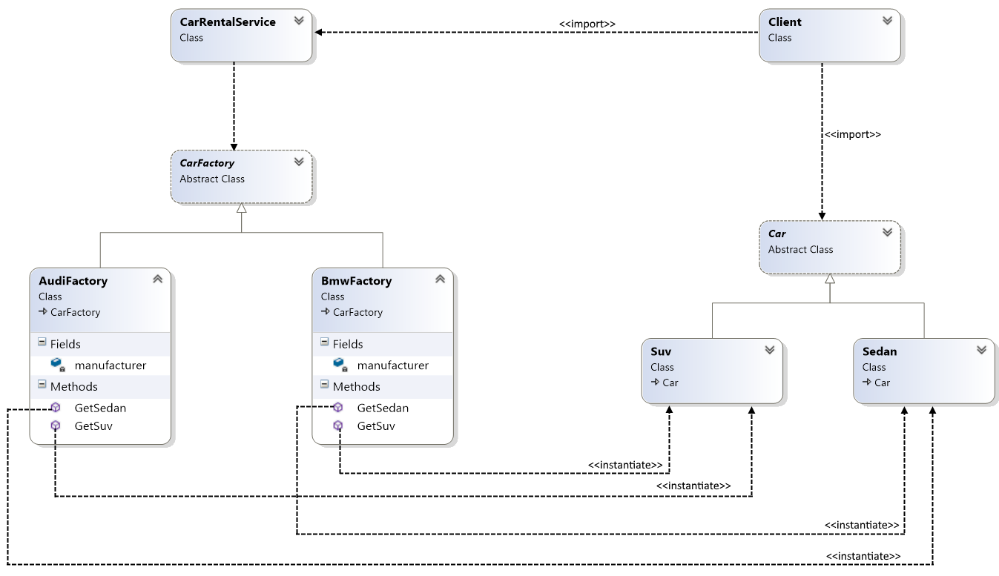

# Abstract Factory
### Creational Design Pattern

## Обобщение
Abstract Factory Pattern-ът предоставя начин, по който да се енкапсулира създаването на сходни конкретни обекти, 
без да се конкретизират техните класове.
Клиентът създава конкретна имплементация на абстрактната фабрика и я използва през абстрактния интерфейс,
за да създава конкретни обекти. Той не се интересува какъв конкретен обект получава, тъй като използва само
интерфейса на продукта.

Този шаблон разделя създаването на обект от използването му - фабриката определя конкретния обект и го създава,
но връща само абстрактен показател към конкретния обект. Това изолира клиентския код от създаването на обекта, тъй 
като клиентът получава абстрактен обект от желания тип.

Abstract Factory Pattern-ът се използва при системи, които често се изменят. Предоставя лесен и гъвкъв механизъм
за замяна на конкретни групи от обекти.

## Конкретна имплементация
Car rental service, който си служи с различни производители на автомобили:

###### Abstract car
~~~c#
public abstract class Car
{
    protected Car(int doors, float wheelsSize, int horsePower,
        string manufacturer, string model, string type)
    {
        this.Doors = doors;
        this.WheelsSize = wheelsSize;
        this.HorsePower = horsePower;
        this.Manufacturer = manufacturer;
        this.Model = model;
        this.Type = type;
    }

    public int Doors { get; }
    public float WheelsSize { get; }
    public int HorsePower { get; }
    public string Manufacturer { get; }
    public string Model { get; }
    public string Type { get; }

    public override string ToString()
    {
        return $"{this.Manufacturer} {this.Model}{Environment.NewLine}" +
               $"{this.Type}{Environment.NewLine}" +
               $"Doors: {this.Doors}{Environment.NewLine}" +
               $"Wheels size: {this.WheelsSize}{Environment.NewLine}" +
               $"HP: {this.HorsePower}";
    }
}
~~~

###### Abstract car factory
~~~c#
public abstract class CarFactory
{
    protected CarFactory()
    {   
    }

    public abstract Suv GetSuv();

    public abstract Sedan GetSedan();
}
~~~

###### SUV and Sedane classes
~~~c#
public class Sedan : Car
{
    public Sedan(int doors, float wheelsSize, int horsePower, string manufacturer, string model)
        :base(doors, wheelsSize, horsePower, manufacturer, model, "Sedan")
    { }
}
~~~
~~~c#
public class Suv : Car
{
    public Suv(int doors, float wheelsSize, int horsePower, string manufacturer, string model)
        :base(doors, wheelsSize, horsePower, manufacturer, model, "SUV")
    { }
}
~~~

###### Concrete car factories
~~~c#
public class AudiFactory : CarFactory
{
    private readonly string manufacturer = "Audi";

    public override Suv GetSuv()
    {
        return new Suv(5, 20.5f, 300, this.manufacturer, "Q7");
    }

    public override Sedan GetSedan()
    {
        return new Sedan(4, 17.0f, 245, this.manufacturer, "A7");
    }
}
~~~

~~~c#
public class BmwFactory : CarFactory
{
    private readonly string manufacturer = "BMW";

    public override Suv GetSuv()
    {
        return new Suv(5, 20.0f, 310, this.manufacturer, "X5");
    }

    public override Sedan GetSedan()
    {
        return new Sedan(4, 17.5f, 245, this.manufacturer, "530xd");
    }
}
~~~

###### Car Rental Class
~~~c#
public class CarRentalService
{
    private readonly CarFactory factory;

    public CarRentalService(CarFactory factory)
    {
        if (factory == null) throw new ArgumentNullException(nameof(factory));
        this.factory = factory;
    }

    public Suv RentSuv()
    {
        return this.factory.GetSuv();
    }

    public Sedan RentSedan()
    {
        return this.factory.GetSedan();
    }
}
~~~

###### Usage
~~~c#
class Client
{
    static void Main()
    {
        var audiRental = new CarRentalService(new AudiFactory());

        Console.WriteLine(audiRental.RentSuv());
        Console.WriteLine(new string('-', 30));
        Console.WriteLine(audiRental.RentSedan());
    }
}
~~~
