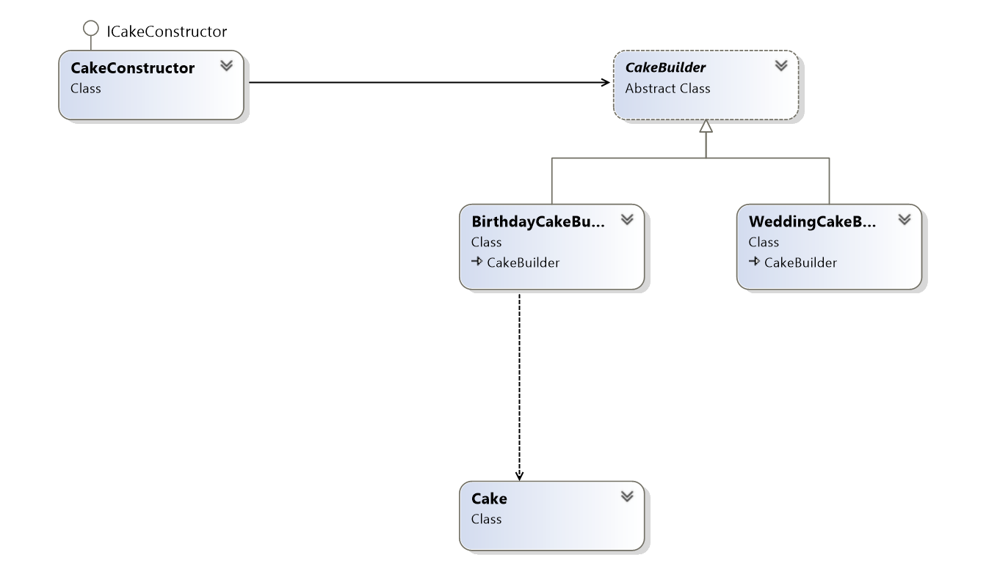

# Builder
### Creational Design Pattern

## Обобщение
Builder Pattern-ът разделя логиката по създаването на обекта от използването му. Така един и същи процес на конструиране
може да създаде обекти с различни данни.
Този шаблон енкапсулира и опростява създаването на обекта. Благодарение на него се избяга подаване на голям брой параметри,
order dependency и множество конструктори.

Шаблонът си служи с Director, абстрактен Builder (определя логиката по създаването, последователността) и конкретен Builder,
който отговаря за конкретната имплементация на създаването.

## Конкретна имплементация
Builder за конструиране на торти:

###### Cake
~~~c#
public class Cake
{
    private readonly string type;
    private readonly List<string> decorations; 

    public Cake(string type)
    {
        this.type = type;
        this.decorations = new List<string>();
    }

    public int Layers { get; set; }
    public string Flavour { get; set; }
    public string FrostingColor { get; set; }

    public void AddDecorations(params string[] decorations)
    {
        this.decorations.AddRange(decorations);
    }

    private string GetDecorationsString()
    {
        if (decorations.Count == 0)
        {
            return "None";
        }
        else
        {
            return string.Join(", ", this.decorations);
        }
    }

    public override string ToString()
    {
        return $"{this.type} cake{Environment.NewLine}" +
               $"{this.Layers} layers{Environment.NewLine}" +
               $"{this.Flavour} flavour{Environment.NewLine}" +
               $"{this.FrostingColor} frosting{Environment.NewLine}" +
               $"decorations: {this.GetDecorationsString()}";
    }
}
~~~

###### Abstract cake builder

~~~c#
public abstract class CakeBuilder
{
    protected CakeBuilder(string cakeType)
    {
        this.Cake = new Cake(cakeType);
    }

    public Cake Cake { get; protected set; }

    public abstract void BuildLayers();
    public abstract void BuildFlavour();
    public abstract void BuildFrosting();
    public abstract void BuildDecorations();
}
~~~

###### Birthday cake
~~~c#
public class BirthdayCakeBuilder : CakeBuilder
{
    public BirthdayCakeBuilder() : base("Birthday")
    {
    }

    public override void BuildLayers()
    {
        this.Cake.Layers = 2;
    }

    public override void BuildFlavour()
    {
        this.Cake.Flavour = "chocolate";
    }

    public override void BuildFrosting()
    {
        this.Cake.FrostingColor = "blue";
    }

    public override void BuildDecorations()
    {
        this.Cake.AddDecorations("candles", "chocolate name plate", "sprinkles");
    }
}
~~~

###### Wedding cake
~~~c#
public class WeddingCakeBuilder : CakeBuilder
{
    public WeddingCakeBuilder() : base("Wedding")
    {
    }

    public override void BuildLayers()
    {
        this.Cake.Layers = 3;
    }

    public override void BuildFlavour()
    {
        this.Cake.Flavour = "lemon-vanilla";
    }

    public override void BuildFrosting()
    {
        this.Cake.FrostingColor = "white";
    }

    public override void BuildDecorations()
    {
        this.Cake.AddDecorations("wedding figure");
    }
}
~~~

###### Director interface
~~~c#
public interface ICakeConstructor
{
    void Construct(CakeBuilder cakeBuilder);
}
~~~

###### Director implementation
~~~c#
class CakeConstructor : ICakeConstructor
{
    public void Construct(CakeBuilder cakeBuilder)
    {
        cakeBuilder.BuildLayers();
        cakeBuilder.BuildFlavour();
        cakeBuilder.BuildFrosting();
        cakeBuilder.BuildDecorations();
    }
}
~~~

###### Usage
~~~c#
static void Main()
{
    ICakeConstructor constructor = new CakeConstructor();

    CakeBuilder builder = new BirthdayCakeBuilder();
    constructor.Construct(builder);
    Console.WriteLine(builder.Cake);

    Console.WriteLine(new string('-', 30));

    builder = new WeddingCakeBuilder();
    constructor.Construct(builder);
    Console.WriteLine(builder.Cake);
}
~~~
