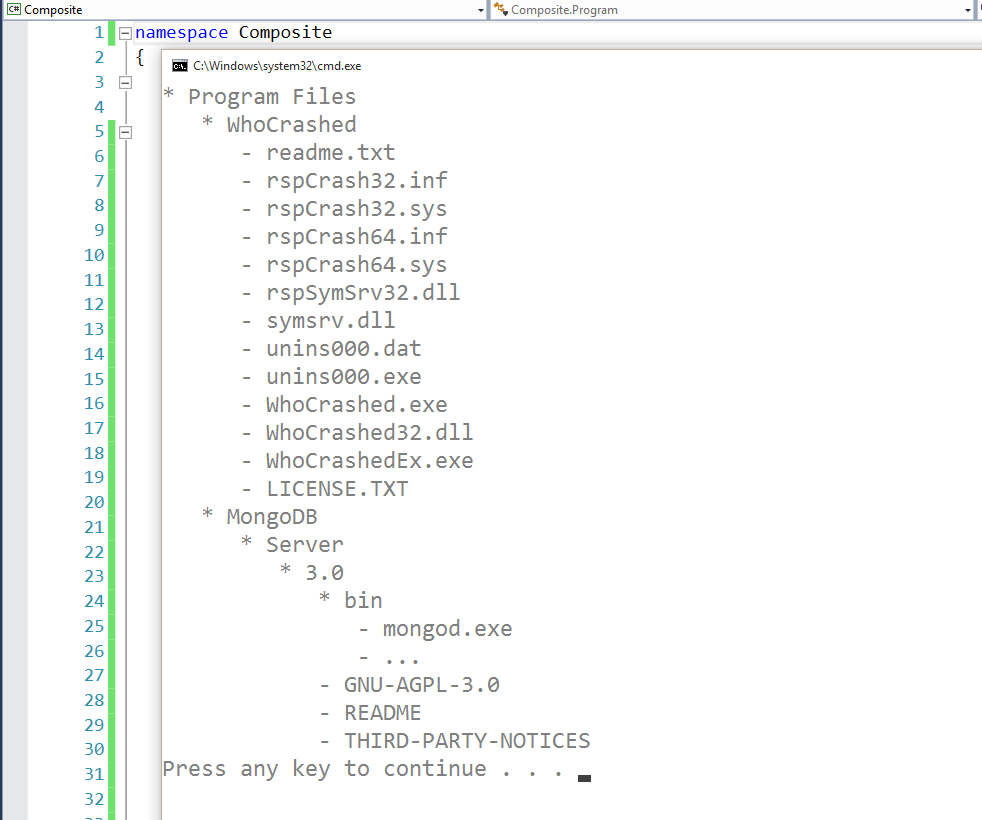

# Composite
### Structural Design Pattern

#### Обобщение
Composite Pattern-ът е шаблон, който се използва в обектно-ориентираното програмиране. Той ни позволява да създаваме йерархия от класове, като ги комбинираме в дървовидна структура.Също така, ни позволява да третираме простите обкети (листата) и композитните обекти по един и същи начин.

#### Структура
###### Component
* абстракцията на всички компоненти, вкл. композитните

###### Leaf
* представлява простата имплементация на Component интерфейса
 
###### Composite
* представлява композитната имплементация на Component-a (композитните обекти могат да имат деца)
* имплементира методи за работа с децата си

#### Demo
###### FileSystemEntity
~~~c#
public abstract class FileSystemEntity
{
    protected FileSystemEntity(string name)
    {
        this.Name = name;
    }

    public string Name { get; private set; }

    public abstract void Print(int padding);
}
~~~

###### File
~~~c#
public class File : FileSystemEntity
{
    public File(string name) : base(name)
    {
    }

    public override void Print(int padding)
    {
        Console.WriteLine(new string(' ', padding) + $"- {this.Name}");
    }
}
~~~

###### Folder
~~~c#
public class Folder : FileSystemEntity
{
    private readonly ICollection<FileSystemEntity> content; 

    public Folder(string name) : base(name)
    {
        this.content = new List<FileSystemEntity>();
    }

    public void Add(FileSystemEntity entity)
    {
        this.content.Add(entity);
    }

    public void Remove(FileSystemEntity entity)
    {
        this.content.Remove(entity);
    }

    public override void Print(int padding)
    {
        Console.WriteLine(new string(' ', padding) + $"* {this.Name}");

        foreach (var fileSystemEntity in this.content)
        {
            fileSystemEntity.Print(padding + 3);
        }
    }
}
~~~

###### Usage
~~~c#
static void Main()
{
    var programFilesFolder = new Folder("Program Files");

    var whoCrashedFolder = new Folder("WhoCrashed");
    whoCrashedFolder.Add(new File("readme.txt"));
    whoCrashedFolder.Add(new File("rspCrash32.inf"));
    whoCrashedFolder.Add(new File("rspCrash32.sys"));
    whoCrashedFolder.Add(new File("rspCrash64.inf"));
    whoCrashedFolder.Add(new File("rspCrash64.sys"));
    whoCrashedFolder.Add(new File("rspSymSrv32.dll"));
    whoCrashedFolder.Add(new File("symsrv.dll"));
    whoCrashedFolder.Add(new File("unins000.dat"));
    whoCrashedFolder.Add(new File("unins000.exe"));
    whoCrashedFolder.Add(new File("WhoCrashed.exe"));
    whoCrashedFolder.Add(new File("WhoCrashed32.dll"));
    whoCrashedFolder.Add(new File("WhoCrashedEx.exe"));
    whoCrashedFolder.Add(new File("LICENSE.TXT"));

    programFilesFolder.Add(whoCrashedFolder);
    
    
    var versionFolder = new Folder("3.0");
    var binFolder = new Folder("bin");
    binFolder.Add(new File("mongod.exe"));
    binFolder.Add(new File("..."));
    versionFolder.Add(binFolder);
    versionFolder.Add(new File("GNU-AGPL-3.0"));
    versionFolder.Add(new File("README"));
    versionFolder.Add(new File("THIRD-PARTY-NOTICES"));
    var serverFolder = new Folder("Server");
    serverFolder.Add(versionFolder);
    var mongoDbFolder = new Folder("MongoDB");
    mongoDbFolder.Add(serverFolder);
    programFilesFolder.Add(mongoDbFolder);

    programFilesFolder.Print(0);
}
~~~

###### Output

