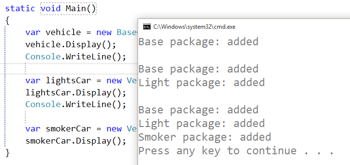

# Decorator
### Structural Design Pattern

#### Обобщение
Decorator Pattern-ът е шаблон, който се използва в обектно-ориентираното програмиране. Този шаблон може да бъде използван за разширяването на функционалността на опеределен клас по времето на изпълнение на програмата, като запазва интерфейса му. Той е много подходящ, когато се следва Single responsibility принципът, според който един клас трябва да е отговорен за една единствена операция.

#### Структура
* Component – интерфейсът на обектите, към които могат да се добавят допълнителни функционалности или качества динамично;
* ConcreteComponent – обектът, към който ще се добавя нова функционалност;
* Decorator – пази референция към компонент обекта и създава интерфейса, който съвпада с този на компонента;
* ConcreteDecorator – прибавя нови функционалности към обекта;

#### Demo
###### Vehicle
~~~c#
public abstract class Vehicle
{
    protected Vehicle()
    {
    }

    public abstract void Display();
}
~~~

###### BaseCar
~~~c#
public class BaseCar : Vehicle
{
    public override void Display()
    {
        Console.WriteLine("Base package: added");
    }
}
~~~

###### Decorator
~~~c#
internal abstract class Decorator : Vehicle
{
    protected Decorator(Vehicle vehicle)
    {
        this.Vehicle = vehicle;
    }

    protected Vehicle Vehicle { get; set; }

    public override void Display()
    {
        this.Vehicle.Display();
    }
}
~~~

###### VehicleWithLightPackage
~~~c#
public class VehicleWithLightPackage : Decorator
{
    public VehicleWithLightPackage(Vehicle vehicle) : base(vehicle)
    {
    }

    public override void Display()
    {
        base.Vehicle.Display();
        Console.WriteLine("Light package: added");
    }
}
~~~

###### VehicleWithSmokerPackage
~~~c#
public class VehicleWithSmokerPackage : Decorator
{
    public VehicleWithSmokerPackage(Vehicle vehicle) : base(vehicle)
    {
    }

    public override void Display()
    {
        base.Display();
        Console.WriteLine("Smoker package: added");
    }
}
~~~

###### Usage
~~~c#
static void Main()
{
    var vehicle = new BaseCar();
    vehicle.Display();
    Console.WriteLine();

    var lightsCar = new VehicleWithLightPackage(vehicle);
    lightsCar.Display();
    Console.WriteLine();

    var smokerCar = new VehicleWithSmokerPackage(lightsCar);
    smokerCar.Display();
}
~~~

###### Output

