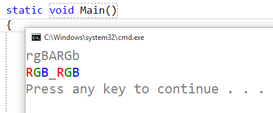

# Flyweight
### Structural Design Pattern

#### Обобщение
Flyweight Pattern-ът е шаблон, който се използва в обектно-ориентираното програмиране. Използва се за споделяне на сложни и бавни за създаване (ресурсоемки) обекти.

#### Структура
* Flyweight – интерфейсът на обектите;
* Concrete Flyweight;
* Flyweight Factory - осигурява достъпа до Flyweight обектите. Създава обект, ако конкретният още не е използван/създаден или връща вече създаден обект от същия тип;

#### Demo
###### Symbol
~~~c#
public abstract class Symbol
{
    protected Symbol(char symbol)
    {
        this.Character = symbol;
    }

    protected char Character { get; set; }
    protected ConsoleColor Color { get; set; }

    public virtual void Print()
    {
        var defaultColor = Console.ForegroundColor;

        Console.ForegroundColor = this.Color;
        Console.Write(this.Character);

        Console.ForegroundColor = defaultColor;
    }
}
~~~

###### SymbolR, SymbolG, SymbolB, UnknownSymbol
~~~c#
public class SymbolR : Symbol
{
    public SymbolR(char symbol) : base(symbol)
    {
        this.Color = ConsoleColor.Red;
    }
}
~~~

~~~c#
public class SymbolG : Symbol
{
    public SymbolG(char symbol) : base(symbol)
    {
        this.Color = ConsoleColor.DarkGreen;
    }
}
~~~

~~~c#
public class SymbolB : Symbol
{
    public SymbolB(char symbol) : base(symbol)
    {
        this.Color = ConsoleColor.Blue;
    }
}
~~~

~~~c#
class UnknownSymbol:Symbol
{
    public UnknownSymbol(char symbol) : base(symbol)
    {
    }

    public override void Print()
    {
        Console.Write('_');
    }
}
~~~

###### Symbol Factory
~~~c#
public class SymbolFactory
{
    private readonly Dictionary<char, Symbol> symbols;

    public SymbolFactory()
    {
        this.symbols = new Dictionary<char, Symbol>();
    }

    public Symbol GetSymbol(char symbol)
    {
        var key = char.ToUpper(symbol);

        if (this.symbols.ContainsKey(key))
        {
            return this.symbols[key];
        }
        else
        {
            Symbol symbolObj;

            switch (key)
            {
                case 'R':
                    symbolObj = new SymbolR('R');
                    break;
                case 'G':
                    symbolObj = new SymbolG('G');
                    break;
                case 'B':
                    symbolObj = new SymbolB('B');
                    break;
                default:
                    symbolObj = new UnknownSymbol(key);
                    break;
            }

            this.symbols.Add(key, symbolObj);
            return symbolObj;
        }
    }
}
~~~

###### Usage
~~~c#
static void Main()
{
    var symbols = "rgBARGb";
    var symbolFactory = new SymbolFactory();

    Console.WriteLine(symbols);

    foreach (var s in symbols)
    {
        var symbol = symbolFactory.GetSymbol(s);
        symbol.Print();
    }
    Console.WriteLine();
}
~~~

###### Output

